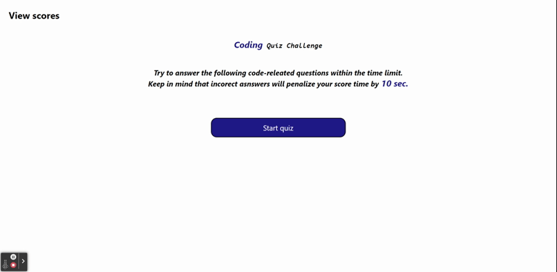

# Quiz-game

## Description

A timed coding quiz to test your knowledge of JavaScript fundamentals.

## Table of Contents

- [Installation](#installation) 
- [Usage](#usage)
- [Credits](#credits)
- [License](#license)
- [Contribute](#contribute)
- [Tests](#tests)
- [Questions](#questions)

## Installation

There are no requirement of installing any application to run this 

## Usage

To accesss this website/application to play Quiz please visit https://renjithkumar993.github.io/Quiz-game/

## License

This application is licensed under MIT.

## Contribute

n/a

## Tests

npm test

## Questions

If you have any questions or concerns regarding the project, please feel free to reach out to me. Here are the ways you can contact me:

Email: renjithkumar993@gmail.com

GitHub: https://github.com/renjithkumar993

I will do my best to respond to your inquiries in a timely manner. Thank you for your interest in the project!

